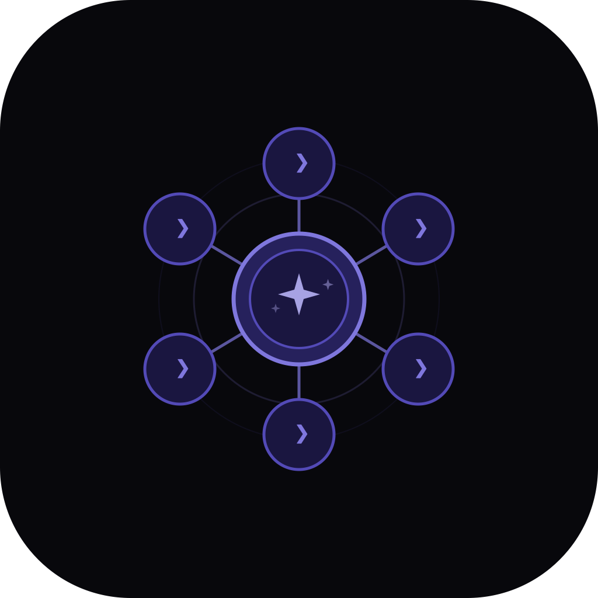

<p align="center">
  
</p>

<h1 align="center">Clauge</h1>

<p align="center">
  <strong>Visual session manager for Claude Code — organize, label, and resume sessions effortlessly</strong>
</p>

<p align="center">
  <a href="https://github.com/ansxuman/Clauge/blob/main/LICENSE"></a>
  <a href="https://github.com/ansxuman/Clauge/stargazers"></a>
  <a href="https://github.com/ansxuman/Clauge/issues"></a>
  <a href="https://github.com/ansxuman/Clauge/releases/latest"></a>
</p>

<p align="center">
  <a href="https://github.com/ansxuman/Clauge/issues">Report Bug</a> ·
  <a href="https://github.com/ansxuman/Clauge/issues">Request Feature</a> ·
  <a href="https://buymeacoffee.com/ansxuman">Buy me a coffee</a>
</p>

---

## The Problem

When using Claude Code (`claude` CLI), you can resume sessions with `claude --resume`. But in the terminal, it's impossible to know which session belongs to which project or what the purpose of that session was. Session IDs are UUIDs buried in `~/.claude/projects/`.

## The Solution

Clauge gives you a visual, organized way to manage, label, and resume Claude Code sessions — all from a native macOS desktop app with an embedded terminal.

## Features

- **Session Profiles** — Create labeled sessions with title and purpose (Brainstorming, Development, Code Review, Debugging)
- **Project Grouping** — Sessions organized by project folder with expand/collapse
- **Embedded Terminal** — Full xterm.js terminal with PTY — no external terminal needed
- **Multi-Session** — Switch between active sessions instantly without re-spawning
- **Auto-Discovery** — Automatically finds and links existing Claude Code sessions
- **Usage Tracking** — Real-time session and weekly usage limits in the menu bar
- **macOS Native** — Vibrancy sidebar, hidden titlebar, system tray, dark/light themes
- **Keyboard Shortcuts** — `Cmd+N` new session, `Cmd+1-9` switch sessions
- **Theme Engine** — Dark and light themes with 6 accent color options
- **Context Injection** — Purpose-based context prompts auto-injected when starting sessions

## Download

<p>
  <a href="https://github.com/ansxuman/Clauge/releases/latest"><strong>Download for macOS →</strong></a>
</p>

> macOS only. Built with native macOS APIs (vibrancy, keychain, NSURLSession).

## Development

### Prerequisites

- [Bun](https://bun.sh) (latest)
- [Rust](https://rustup.rs) (1.77+)
- [Tauri CLI](https://tauri.app) v2

### Setup

```bash
# Clone the repository
git clone https://github.com/ansxuman/Clauge.git
cd Clauge

# Install dependencies
bun install

# Run in development mode
bun run tauri dev

# Build for production
bun run tauri build
```

### Compile the usage fetcher (optional)

```bash
swiftc -O -o src-tauri/scripts/fetch_usage src-tauri/scripts/fetch_usage.swift
```

## Tech Stack

| Layer | Technology |
|-------|-----------|
| Frontend | SvelteKit + Svelte 5 |
| Backend | Rust + Tauri v2 |
| Terminal | xterm.js + portable-pty |
| Styling | CSS variables + macOS vibrancy |
| Usage API | Swift (NSURLSession) |
| Package Manager | Bun |

## Usage Tracking Setup

To see real-time usage limits in the menu bar:

1. Open **Settings** (gear icon) → **Usage** tab
2. Get your session key: Open `claude.ai` in browser → DevTools (F12) → Application → Cookies → copy `sessionKey` value
3. Paste and save — usage refreshes every 5 minutes

## Contributing

See [CONTRIBUTING.md](.github/CONTRIBUTING.md) for guidelines.

## License

[MIT](LICENSE)

---

<p align="center">
  Made by <a href="https://github.com/ansxuman">@ansxuman</a>
</p>
