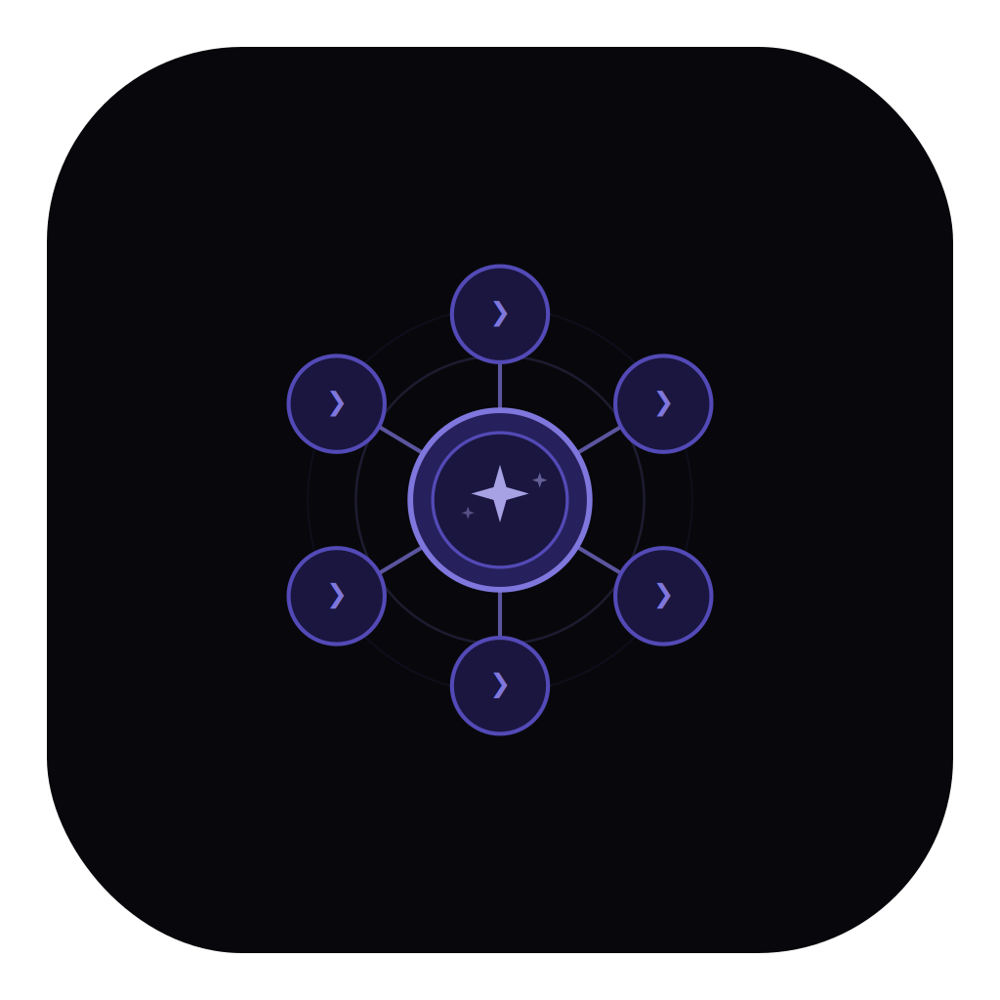

<p align="center">
  
</p>

<h1 align="center">Clauge</h1>

<p align="center">
  Run multiple Claude Code sessions in parallel — organized by project, each with its own purpose and terminal.
</p>

<p align="center">
  <a href="https://github.com/ansxuman/Clauge/blob/main/LICENSE"></a>
  <a href="https://github.com/ansxuman/Clauge/stargazers"></a>
  <a href="https://github.com/ansxuman/Clauge/issues"></a>
  <a href="https://github.com/ansxuman/Clauge/releases/latest"></a>
</p>

<p align="center">
  <a href="https://github.com/ansxuman/Clauge/issues">Report Bug</a> ·
  <a href="https://github.com/ansxuman/Clauge/issues">Request Feature</a> ·
  <a href="https://buymeacoffee.com/ansxuman">Buy me a coffee</a>
</p>

---

## Session Purposes

Each session runs with a specific purpose. Claude stays in that mode throughout the conversation.

| Purpose | What happens |
|---------|-------------|
| **Brainstorming** | Explores ideas, asks questions, compares approaches. Won't jump to code until you say so. |
| **Development** | Writes clean code, follows your codebase patterns, makes small focused changes. |
| **Code Review** | Reviews your recent changes — finds bugs, security issues, missing edge cases. Gives specific, actionable feedback. |
| **PR Review** | Asks for the branch, pulls the diff, and reviews the entire PR. Summarizes what changed and what needs fixing. |
| **Debugging** | Reproduces the issue, traces the root cause step by step, verifies the fix. No guessing. |

## Features

**Parallel sessions, zero conflicts** — Run multiple sessions on the same project. Each one is automatically isolated so they don't overwrite each other's work.

**Embedded terminal** — Full interactive terminal built in. Colors, scrollback, resize. Switch between sessions instantly without re-spawning Claude.

**~10MB, low resource usage** — Built with Rust and Tauri. No Electron, no bundled Chromium. Starts fast, stays light.

**Organized by project** — Sessions grouped by project folder with expand/collapse. Auto-discovers your existing Claude Code sessions.

**Usage tracking** — Session and weekly usage limits visible in the menu bar. Know how much headroom you have without leaving the app.

**Themes and shortcuts** — Dark/light themes, accent colors. `Cmd+N` new session, `Cmd+1-9` switch, `Cmd+B` toggle sidebar.

## Download

<a href="https://github.com/ansxuman/Clauge/releases/latest"><strong>Download for macOS →</strong></a>

## Development

**Requires:** [Bun](https://bun.sh), [Rust](https://rustup.rs) 1.77+, [Tauri CLI](https://tauri.app) v2

```bash
git clone https://github.com/ansxuman/Clauge.git
cd Clauge
bun install
bun run tauri dev
```

## Tech Stack

| | |
|---|---|
| **Frontend** | SvelteKit, Svelte 5 |
| **Backend** | Rust, Tauri v2 |
| **Terminal** | xterm.js, portable-pty |

## Contributing

See [CONTRIBUTING.md](.github/CONTRIBUTING.md).

## Support

<a href="https://www.buymeacoffee.com/ansxuman" target="_blank"></a>

## License

[Apache License 2.0](LICENSE)
